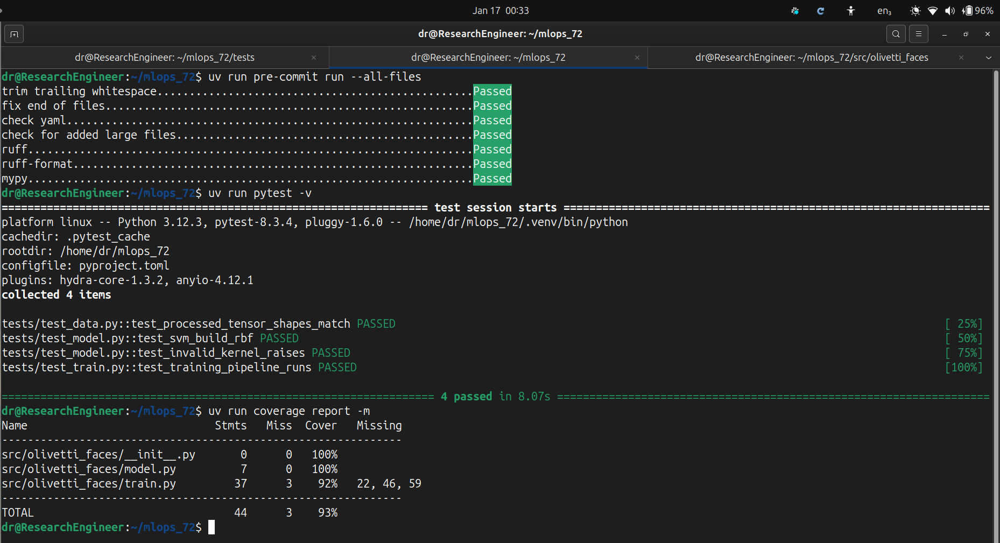
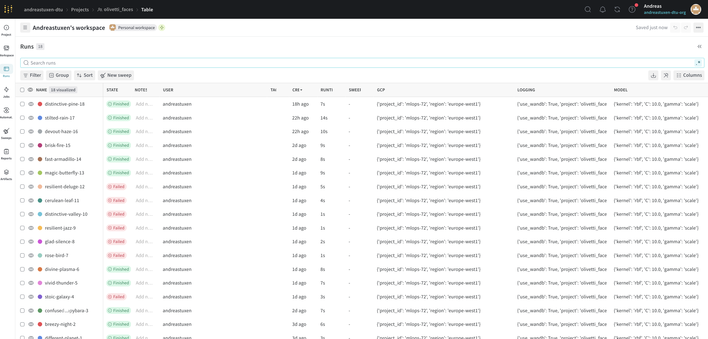
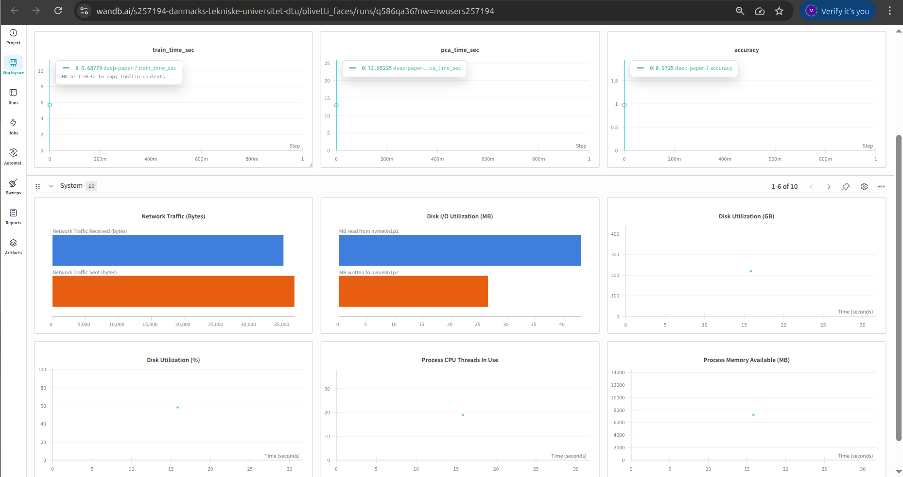
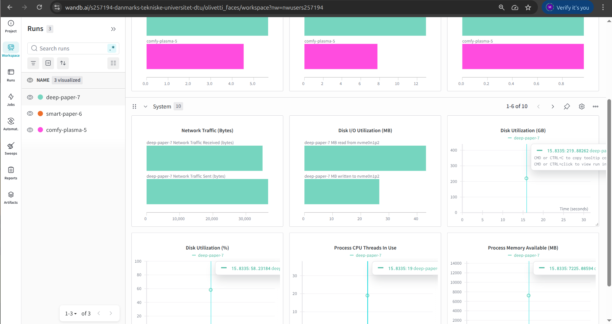
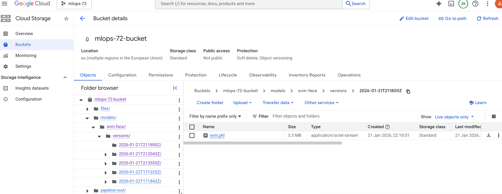
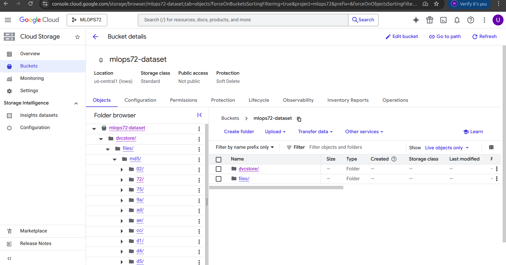
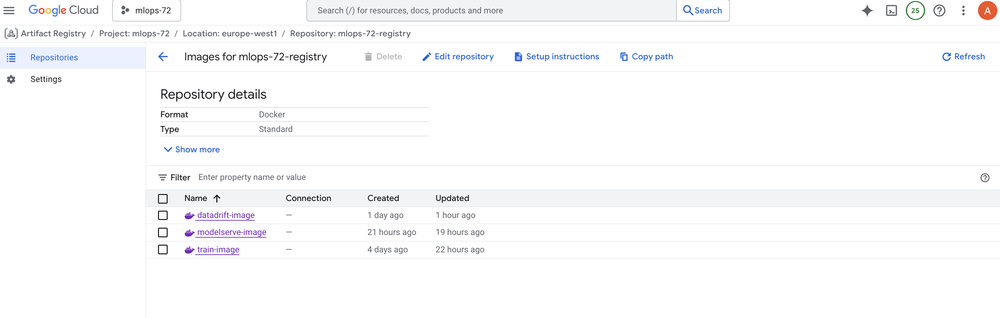
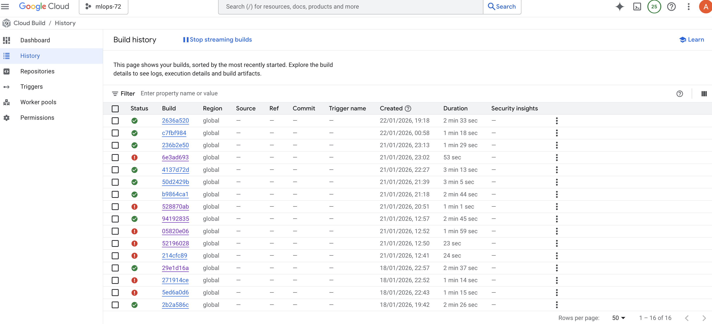
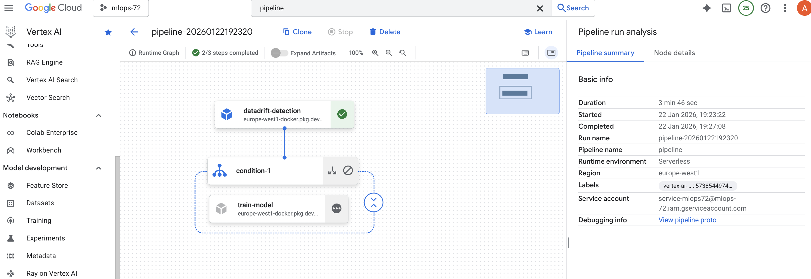
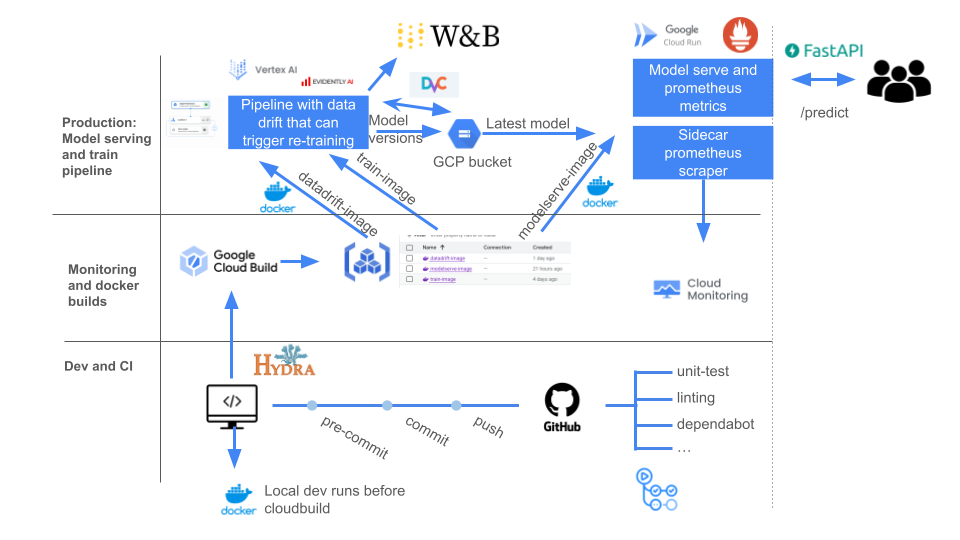

# Exam template for 02476 Machine Learning Operations

This is the report template for the exam. Please only remove the text formatted as with three dashes in front and behind
like:

```--- question 1 fill here ---```

Where you instead should add your answers. Any other changes may have unwanted consequences when your report is
auto-generated at the end of the course. For questions where you are asked to include images, start by adding the image
to the `figures` subfolder (please only use `.png`, `.jpg` or `.jpeg`) and then add the following code in your answer:

``

In addition to this markdown file, we also provide the `report.py` script that provides two utility functions:

Running:

```bash
python report.py html
```

Will generate a `.html` page of your report. After the deadline for answering this template, we will auto-scrape
everything in this `reports` folder and then use this utility to generate a `.html` page that will be your serve
as your final hand-in.

Running

```bash
python report.py check
```

Will check your answers in this template against the constraints listed for each question e.g. is your answer too
short, too long, or have you included an image when asked. For both functions to work you mustn't rename anything.
The script has two dependencies that can be installed with

```bash
pip install typer markdown
```

or

```bash
uv add typer markdown
```

## Overall project checklist

The checklist is *exhaustive* which means that it includes everything that you could do on the project included in the
curriculum in this course. Therefore, we do not expect at all that you have checked all boxes at the end of the project.
The parenthesis at the end indicates what module the bullet point is related to. Please be honest in your answers, we
will check the repositories and the code to verify your answers.

## To-Do's:
### Week 1

- [x] Create a git repository (M5)
- [x] Make sure that all team members have write access to the GitHub repository (M5)
- [x] Create a dedicated environment for your project to keep track of your packages (M2)
- [x] Create the initial file structure using Cookiecutter with an appropriate template (M6)
- [x] Fill out the `data.py` file to download and preprocess the data (M6)
- [x] Add a model to `model.py` and a training procedure to `train.py` and get it running (M6)
- [x] Fill out `requirements.txt` / `requirements_dev.txt` or keep `pyproject.toml` / `uv.lock` up to date (M2 + M6)
- [x] Comply with good coding practices (PEP8) (M7)
- [x] Document essential parts of the code (M7)
- [x] Set up version control for your data (M8)
- [x] Add command line interfaces and project commands where it makes sense (M9)
- [x] Construct one or more Dockerfiles (M10)
- [x] Build the Docker images locally and make sure they work (M10)
- [x] Write one or more configuration files for your experiments (M11)
- [x] Use Hydra to load configurations and manage hyperparameters (M11)
- [-] Use profiling to optimize your code (M12)
- [x] Use logging to log important events (M14)
- [x] Use Weights & Biases to log training progress and metrics (M14)
- [x] Run a hyperparameter optimization sweep (M14)
- [-] Use PyTorch Lightning if applicable (M15)

### Week 2

- [x] Write unit tests for data processing (M16)
- [x] Write unit tests for model construction and training (M16)
- [x] Calculate code coverage (M16)
- [x] Set up continuous integration in GitHub (M17)
- [x] Add caching and multi-OS / Python / PyTorch testing (M17)
- [x] Add a linting step to CI (M17)
- [x] Add pre-commit hooks (M18)
- [x] Add a workflow that triggers when data changes (M19)
- [x] Add a workflow that triggers when the model registry changes (M19)
- [x] Create a GCP bucket for data and connect it to DVC (M21)
- [x] Create a workflow for automatic Docker builds (M21)
- [x] Run model training on GCP (Compute Engine or Vertex AI) (M21)
- [x] Create a FastAPI inference service (M22)
- [x] Deploy the model on GCP (Cloud Functions or Cloud Run) (M23)
- [-] Write API tests and add them to CI (M24)
- [-] Load test the API (M24)
- [-] Create a specialized ML deployment API using ONNX and/or BentoML (M25)
- [-] Create a frontend for the API (M26)


### Week 3

- [-] Test robustness to data drift (M27)
- [-] Collect input-output data from the deployed API (M27)
- [x] Deploy a drift detection service (M27)
- [x] Instrument the API with system metrics (M28)
- [x] Set up cloud monitoring (M28)
- [-] Create alerting in GCP (M28)
- [-] Optimize data loading with distributed pipelines if applicable (M29)
- [-] Optimize training with distributed training if applicable (M30)
- [x] Apply quantization, pruning, and compilation for faster inference (M31)


### Extra

- [-] Write documentation for the application (M32)
- [-] Publish documentation on GitHub Pages (M32)
- [-] Revisit and evaluate the initial project description
- [-] Create an architectural diagram of the MLOps pipeline
- [x] Ensure all team members understand all parts of the project
- [x] Upload all code to GitHub

## Group information

### Question 1
> **Enter the group number you signed up on <learn.inside.dtu.dk>**
>
> Answer:

Group 72

### Question 2
> **Enter the study number for each member in the group**
>
> Example:
>
> *sXXXXXX, sXXXXXX, sXXXXXX*
>
> Answer:

s257194(EuroTeQ) , s153408 (achtu)

### Question 3
> **Did you end up using any open-source frameworks/packages not covered in the course during your project? If so**
> **which did you use and how did they help you complete the project?**
>
> Recommended answer length: 0-200 words.
>
> Example:
> *We used the third-party framework ... in our project. We used functionality ... and functionality ... from the*
> *package to do ... and ... in our project*.
>
> Answer: Yes, we used Kaggle Hub in this project. It provides integrated environment with pre-installed packages to streamline workflow without additional setup.

## Coding environment

> In the following section we are interested in learning more about you local development environment. This includes
> how you managed dependencies, the structure of your code and how you managed code quality.

### Question 4

> **Explain how you managed dependencies in your project? Explain the process a new team member would have to go**
> **through to get an exact copy of your environment.**
>
> Recommended answer length: 100-200 words
>
> Example:
> *We used ... for managing our dependencies. The list of dependencies was auto-generated using ... . To get a*
> *complete copy of our development environment, one would have to run the following commands*
>
> Answer: We managed dependencies using uv (python package manager) as well as locked pyproject.toml–based workflow. All runtime and development dependencies (testing, linting, CI tools) were declared explicitly in our pyproject.toml file, and exact versions are resolved and frozen via the lock file to guarantee reproducibility. We assumed Python ≥ 3.12.3 everywhere, enforced consistently across local development, CI, and even in Docker. For a new team member to get an identical environment is now super easy. He/she or They simply need Python 3.12.3 installed, then run "uv sync" in Virtual enviornment. This will install the exact dependency graph, including PyTorch, Hydra, WandB, pytest, coverage, and pre-commit. Therefore,no manual installs are required.

### Question 5

> **We expect that you initialized your project using the cookiecutter template. Explain the overall structure of your**
> **code. What did you fill out? Did you deviate from the template in some way?**
>
> Recommended answer length: 100-200 words
>
> Example:
> *From the cookiecutter template we have filled out the ... , ... and ... folder. We have removed the ... folder*
> *because we did not use any ... in our project. We have added an ... folder that contains ... for running our*
> *experiments.*
>
> Answer: We initialized and strictly stayed with the project template generated using cookiecutter. The input of cookiecutter was  MLOPS template (recommended by Prof. Nicki) and output was clean, production-oriented structure. We filled out the "src/olivetti_faces" package for all core logic, including data handling, model construction, and training pipelines. All configuration were centralized under "configs/" using Hydra, while experiments and artifacts were tracked using "WandB and DVC". The "tests/" directory comprises unit tests, strictly separated from source code.
As a conclusion, we did not remove any template folder that was genereated using cookiecutter, nevertheless,  we extended the template by adding e.g. GitHub Actions workflows and pre-commit hooks etc.

### Question 6

> **Did you implement any rules for code quality and format? What about typing and documentation? Additionally,**
> **explain with your own words why these concepts matters in larger projects.**
>
> Recommended answer length: 100-200 words.
>
> Example:
> *We used ... for linting and ... for formatting. We also used ... for typing and ... for documentation. These*
> *concepts are important in larger projects because ... . For example, typing ...*
>
> Answer: Yes we did implemented rules for code quality and format. We ensured code quality using Ruff for "linting" and pre-commit hooks for "automatic formatting". "Mypy" ensured proper typing, while "docstrings" and "mkdocs" maintained documentation. Indeed, these practices holds significant importance specially in larger projects because they improve readability, maintainability, and reduce bugs (NO TECHNICAL DEBT). Typing clarifies inputs and outputs, preventing subtle errors. Documentation helps new team members quickly understand workflows. Linting and formatting enforce consistency, reduce merge conflicts, and support smooth collaboration.Therefore, we took these measures to make the complete project looks like more professional and easier to scale.
## Version control

> In the following section we are interested in how version control was used in your project during development to
> corporate and increase the quality of your code.

### Question 7

> **How many tests did you implement and what are they testing in your code?**
>
> Recommended answer length: 50-100 words.
>
> Example:
> *In total we have implemented X tests. Primarily we are testing ... and ... as these the most critical parts of our*
> *application but also ... .*
>
> Answer: Regarding unit tests, we implemented total of 3 tests named , test_data, test_model and test_train, all available in the directory "tests". These unit tests simply focuses on the most important parts of the project e.g. verify correct ML model creation, error handling for invalid parameters, and basic validation of processed data artifacts. The simple objective was to ensure data integrity and model configuration correctness without changing the training or preprocessing code.
### Question 8

> **What is the total code coverage (in percentage) of your code? If your code had a code coverage of 100% (or close**
> **to), would you still trust it to be error free? Explain you reasoning.**
>
> Recommended answer length: 100-200 words.
>
> Example:
> *The total code coverage of code is X%, which includes all our source code. We are far from 100% coverage of our **
> *code and even if we were then...*
>
> Answer: The total code coverage of our project is approximately 93%, covering most core components such as data processing, model construction, and training . Although, this level of coverage provides us with strong confidence that the main execution paths behave as expected, however,reality is that, even with 100% coverage, the code cannot be considered completely error free. This metric (coverage) only measures which lines are executed during tests, not whether all corner cases are addressed. There are many possibilities where bugs can originate e.g. configuration issues, unexpected data etc. Therefore, although high test coverage is important, but it must be complemented with CI, linting, code reviews, precommits and monitoring etc.
-


### Question 9

> **Did you workflow include using branches and pull requests? If yes, explain how. If not, explain how branches and**
> **pull request can help improve version control.**
>
> Recommended answer length: 100-200 words.
>
> Example:
> *We made use of both branches and PRs in our project. In our group, each member had an branch that they worked on in*
> *addition to the main branch. To merge code we ...*
>
> Answer: Yes ofcourse (main, Andreas, Hasan). we used branches and pull requests. The main branch was intended to be kept stable, whereas all development was aimed to be done on separate feature branches e.g. (Andreas or Hasan). Most of the time, once everything was Ok , we merged the feature branch with main. Other group member can simply make changes e.g. adding tests, CI workflows, or configuration updates via pull pull requests. At each pull or push to main, code review, automated CI checks were run. Therefore, primary objective of creating these branches was to reduce the risk of breaking the main branch, improved collaboration(multitasking) etc.

### Question 10

> **Did you use DVC for managing data in your project? If yes, then how did it improve your project to have version**
> **control of your data. If no, explain a case where it would be beneficial to have version control of your data.**
>
> Recommended answer length: 100-200 words.
>
> Example:
> *We did make use of DVC in the following way: ... . In the end it helped us in ... for controlling ... part of our*
> *pipeline*
>
> Answer: Yes, indeed we used DVC to version control our datasets and models. As git allows making track of any changes in any part of the code, similarly, DVC allows tracking large files without storing them in github. DVC has the prominent role while ensuring reproducibility and traceability of entire project/experiments. As DVC also enabled remote storage, like a GCP bucket, this helps to smartly share data between us to collaborate without manually sharing large files. Finally, yes it indeed improved reproducibility, experiment management, and collaboration across this project of ML end-to-end pipeline flow. All the versions of change in data is also tracked by git using metadata stored at git. Hence git keeps track of metadata instead of data itself.
### Question 11

> **Discuss you continuous integration setup. What kind of continuous integration are you running (unittesting,**
> **linting, etc.)? Do you test multiple operating systems, Python  version etc. Do you make use of caching? Feel free**
> **to insert a link to one of your GitHub actions workflow.**
>
> Recommended answer length: 200-300 words.
>
> Example:
> *We have organized our continuous integration into 3 separate files: one for doing ..., one for running ... testing*
> *and one for running ... . In particular for our ..., we used ... .An example of a triggered workflow can be seen*
> *here: <weblink>*
>
> Answer: Yes,in our project, we set up continuous integration (CI) using GitHub Actions to ensure reliability as well as reproducibility. The CI workflow runs automatically on pushes and pull requests to the main branch (Any push and pull to local feature branches don't trigger this). It includes "unit testing" of "data processing", "model construction", and "training functions" along with code coverage report, and linting checks using ruff and pre-commit hooks. Moreover, the workflow is configured to run on multiple operating systems e.g. 3 in our case (Ubuntu, Windows, and macOS) and 2 python versions ≥ 3.12.3 to ensure cross-platform compatibility. Furthermore, we also considered different versions of PyTorch in these CI workflow. In addition, we also leverage caching for dependencies and virtual environments via uv to speed up repeated runs. Tests are executed in an isolated environment, loading processed .pt tensors, running SVM + PCA pipelines, and verifying expected outputs. The CI workflow includes coverage reports and detailed logs, providing immediate report on code quality. This setup holds the paramount importance because it ensures that any new changes in the source code, configuration, or data got automatically verified before merging. Finally, it's quite good for team members to replicate the environment reliably. In this project, complete workflow ".YAML file" is in .github/workflows/tests.yaml.


## Running code and tracking experiments

> In the following section we are interested in learning more about the experimental setup for running your code and
> especially the reproducibility of your experiments.

### Question 12

> **How did you configure experiments? Did you make use of config files? Explain with coding examples of how you would**
> **run a experiment.**
>
> Recommended answer length: 50-100 words.
>
> Example:
> *We used a simple argparser, that worked in the following way: Python  my_script.py --lr 1e-3 --batch_size 25*
>
> Answer: We configured experiments using Hydra configuration files stored in the configs/ folder. Each experiment uses config.yaml to define general settings. For example, "pca.yaml" is for PCA components and "model.yaml" is for SVM hyperparameters tuning. This is vital to ensure reproducibility.
 An Example to run our experiment "uv run src/olivetti_faces/train.py --config-name config.yaml"

### Question 13

> **Reproducibility of experiments are important. Related to the last question, how did you secure that no information**
> **is lost when running experiments and that your experiments are reproducible?**
>
> Recommended answer length: 100-200 words.
>
> Example:
> *We made use of config files. Whenever an experiment is run the following happens: ... . To reproduce an experiment*
> *one would have to do ...*
>
> Answer: Indeed it's crucial to ensure reproducibility of experiments. we ensured reproducibility by fixing random seeds in PyTorch, NumPy, and scikit-learn through the Hydra configurations. All data preprocessing outputs are saved as ".pt tensors" in "data/processed/"(locally), and trained models (including PCA + SVM) are serialized using joblib in directory "models/". WandB (a beautiful tool) allows logging to keep record of all hyperparameters, metrics, and runtime details (Against every run also). Through DVC i.e. used for data versioning , it is ensured that no information is lost. Furthermore, combined with Docker and pyproject.toml controlled dependency list, it is guaranteed that experiments can be rerun on any machine with the same results, fully preserving data, code, and environment.

### Question 14

> **Upload 1 to 3 screenshots that show the experiments that you have done in W&B (or another experiment tracking**
> **service of your choice). This may include loss graphs, logged images, hyperparameter sweeps etc. You can take**
> **inspiration from [this figure](figures/wandb.png). Explain what metrics you are tracking and why they are**
> **important.**
>
> Recommended answer length: 200-300 words + 1 to 3 screenshots.
>
> Example:
> *As seen in the first image when have tracked ... and ... which both inform us about ... in our experiments.*
> *As seen in the second image we are also tracking ... and ...*
>
> Answer:In our experiments, we tracked multiple metrics in WandB to monitor training performance and reproducibility. For example, Accuracy is the primary metric for evaluating the SVM classifier’s performance even if data experiences certain drift. Higher accuracy directly indicates better model generalization. In addition, we also locally considered different metrics locally like precision, recall and F1 score, but didn't make them the part of final code. Secondly, PCA Transform Time an important metric used for mapping large data to a set of principle components (Transformation) This helps in monitoring computational efficiency and deciding the optimal number of principal components. SVM Training Time helps to track training duration to understand model scalability for different hyperparameters.These metrics can be considered as extremely important for this olivetti faces data set because it allows quick comparison across experiments, identification of  bottlenecks, and verifying reproducibility.Just an overview,  accuracy and training time together give insight into performance vs. computational cost whereas PCA components help to  balance dimensionality reduction against accuracy loss (by choosing optimal number of pca components to introduce multivariable optimization). zzxx Accuracy vs Epochs for different PCA components. The following screenshots illustrates WandB logs for Training time, PCA time and accuracy. A simultaneous analysis can help us to make comparison across different experiments logs saved by W&B. Finally, together, these visualizations help track model performance, computational efficiency, and reproducibility in a structured and versioned way.
-
-
-

### Question 15

> **Docker is an important tool for creating containerized applications. Explain how you used docker in your**
> **experiments/project? Include how you would run your docker images and include a link to one of your docker files.**
>
> Recommended answer length: 100-200 words.
>
> Example:
> *For our project we developed several images: one for training, inference and deployment. For example to run the*
> *training docker image: `docker run trainer:latest lr=1e-3 batch_size=64`. Link to docker file: <weblink>*
>
> Answer:We used Docker to containerize our (PCA + SVM training) and FastAPI inference, ensuring reproducible environments across machines. The dockerfiles/train.Dockerfile sets up Python ≥3.12.3, PyTorch, Hydra, WandB, and dependencies for training.The dockerfiles/api.Dockerfile prepares the inference service.From docker files we create docker images through BUILD process and its further followed by run.
For example a local build  looks like (For our case via CLI) , docker build -f dockerfiles/train.Dockerfile -t olivetti_train:latest . However, these images can be directly fed to Vertex AI to run in cloud. It such a powerful tool that it guarantees consistent execution, integration with CI, and supports GCP deployment by eliminating local dependency issues.

### Question 16

> **When running into bugs while trying to run your experiments, how did you perform debugging? Additionally, did you**
> **try to profile your code or do you think it is already perfect?**
>
> Recommended answer length: 100-200 words.
>
> Example:
> *Debugging method was dependent on group member. Some just used ... and others used ... . We did a single profiling*
> *run of our main code at some point that showed ...*
>
> Answer: Debugging is indeed very crucial and in our project, it takes around 5 to 10x more time than development. However, once we need debugging, we try to reproduce  the issue on a smaller scale and used print statements and logging to understand where the problem occurred. We also checked the flow of data and results step by step. To see how long parts of the code took, we measured execution times for different steps. This helped us find slow or problematic sections. We did not assume the code was almost perfect,  instead, we fixed issues as they appeared and ensured the results were correct and consistent. This approach helped maintain reliability and reproducibility in our experiments. Also now a days, a generative pretrained transformers (GPT) models are here, it's comparitively much efficient to make debugging by leveraging them as a debugging tool.

## Working in the cloud

> In the following section we would like to know more about your experience when developing in the cloud.

### Question 17

> **List all the GCP services that you made use of in your project and shortly explain what each service does?**
>
> Recommended answer length: 50-200 words.
>
> Example:
> *We used the following two services: Engine and Bucket. Engine is used for... and Bucket is used for...*
>
> Answer: In this project, we opted Vertex AI over the Compute Engine (VMs) for model training and testing due to its streamlined integration with GCP’s machine learning services. Although, we used Compute Engine in course exercises for more custom configurations, Vertex AI offered a fully managed environment that simplified model deployment and scaling. We also utilized GCP Buckets for efficient data storage and Matrix Explorer for model monitoring and analysis.

### Question 18

> **The backbone of GCP is the Compute engine. Explained how you made use of this service and what type of VMs**
> **you used?**
>
> Recommended answer length: 100-200 words.
>
> Example:
> *We used the compute engine to run our ... . We used instances with the following hardware: ... and we started the*
> *using a custom container: ...*
>
> Answer:Although we used computed engine in daily cloud exercises, however, in this project, we used Vertex AI in GCP for model training and testing, instead of relying on the Compute Engine (VMs). Although, compute engine provides flexibility for custom VMs, nevertheless, we choosed Vertex AI to streamline integration with GCP’s (Machine learning services). Vertex AI offers managed environments for training, testing, and deploying models, which eliminates the need for custom setup and scaling. Though Compute Engine could be used to set up custom VMs, however, Vertex AI (we noticed that) was more efficient solution according to our project requirements, enabling better workflow integration and resource management for AI related tasks.

### Question 19

> **Insert 1-2 images of your GCP bucket, such that we can see what data you have stored in it.**
> **You can take inspiration from [this figure](figures/bucket.png).**
>
> Answer: Please find the attached screenshots(GCP bucket).
-
-
### Question 20

> **Upload 1-2 images of your GCP artifact registry, such that we can see the different docker images that you have**
> **stored. You can take inspiration from [this figure](figures/registry.png).**
>
> Answer: Please find the attached screenshot of docker images (Artifact registry).
-

### Question 21

> **Upload 1-2 images of your GCP cloud build history, so we can see the history of the images that have been build in**
> **your project. You can take inspiration from [this figure](figures/build.png).**
>
> Answer: Please find the attached screenshots.

-
-

### Question 22

> **Did you manage to train your model in the cloud using either the Engine or Vertex AI? If yes, explain how you did**
> **it. If not, describe why.**
>
> Recommended answer length: 100-200 words.
>
> Example:
> *We managed to train our model in the cloud using the Engine. We did this by ... . The reason we choose the Engine*
> *was because ...*
>
> Answer: Yes, for us there were intially 2 possibilities. Either to use Virtual machines (Compute) and buckets on GCP and make the whole system like training of ML models. Nevertheless, we choosed to proceed with Vertex AI. We trained our model in the cloud using Vertex AI. The training pipeline was containerized, with data stored in GCP buckets (It was less than 2GB) and hence executed as a Vertex AI training job. This allowed us to leverage managed infrastructure, automatic resource provisioning (Although we didn't used GPUs) only CPU, and easy integration with other Google Cloud services. That's indeed the power of cloud to offer  scalability and reproducibility without any operational overhead compared to local training.
## Deployment

### Question 23

> **Did you manage to write an API for your model? If yes, explain how you did it and if you did anything special. If**
> **not, explain how you would do it.**
>
> Recommended answer length: 100-200 words.
>
> Example:
> *We did manage to write an API for our model. We used FastAPI to do this. We did this by ... . We also added ...*
> *to the API to make it more ...*
>
> Answer: Yes, we managed to write/develop a FastAPI-based model serving application that exposes a prediction endpoint accepting an image payload and returning both the image classification result and the model version used for inference. In addition to the prediction functionality, the model server includes standard health and readiness endpoints to support service monitoring and orchestration. Moreover, a Prometheus client is also integrated into the application to collect and expose operational metrics, which are made available through a dedicated /metrics endpoint. The model server is deployed together with a Prometheus sidecar container, which continuously scrapes these metrics to enable observability and performance monitoring in production.

### Question 24

> **Did you manage to deploy your API, either in locally or cloud? If not, describe why. If yes, describe how and**
> **preferably how you invoke your deployed service?**
>
> Recommended answer length: 100-200 words.
>
> Example:
> *For deployment we wrapped our model into application using ... . We first tried locally serving the model, which*
> *worked. Afterwards we deployed it in the cloud, using ... . To invoke the service an user would call*
> *`curl -X POST -F "file=@file.json"<weburl>`*
>
> Answer: We managed to successfully deploy the model as a cloud run service from the modelserve artifact we built with cloudbuild. When the Cloud Run service is restarted, either due to scaling events or configuration updates or whatever, it automatically loads the latest model weights from the designated models storage bucket. Hence, ot enables automated, repeatable deployments in the cloud environment with minimal manual intervention.This ensures that the service always serves the most up-to-date version of the model without requiring a full rebuild or redeployment of the container image. Finally, this overall process plays the criticial/crucial role to even keep track all the changes/drifts.


### Question 25

> **Did you perform any unit testing and load testing of your API? If yes, explain how you did it and what results for**
> **the load testing did you get. If not, explain how you would do it.**
>
> Recommended answer length: 100-200 words.
>
> Example:
> *For unit testing we used ... and for load testing we used ... . The results of the load testing showed that ...*
> *before the service crashed.*
>
> Answer: We did not implement unit testing for the API in the cloud environment due to time and scope constraints. However, indeed we implemented a locally scheduled system monitoring process to partially compensate for this . This monitor periodically posts a “fake” or synthetic image to the /predict_image endpoint to validate inference functionality and response behavior. In addition, it regularly calls the /healthz and /readyz endpoints to verify service availability as well as readiness. In the cloud environment, we also implemented load testing using Prometheus and Metrics Explorer to observe system performance under varying traffic levels/conditions. Finally, a locally scheduled monitoring system in this project.
### Question 26

> **Did you manage to implement monitoring of your deployed model? If yes, explain how it works. If not, explain how**
> **monitoring would help the longevity of your application.**
>
> Recommended answer length: 100-200 words.
>
> Example:
> *We did not manage to implement monitoring. We would like to have monitoring implemented such that over time we could*
> *measure ... and ... that would inform us about this ... behaviour of our application.*
>
> Answer: We did not manage to implement model drift monitoring within the current scope of the project. However, we successfully implemented data drift monitoring and comprehensive system monitoring against our Olivetti faces data set. The data drift monitoring focuses on detecting changes in input data distributions over time,therefore, help's us to  identify potential risks associated with degradation of model performance. In addition, through system monitoring, we continuously tracks operational metrics such as prediction service latency and the total count of HTTP requests etc. These metrics provide visibility into system once under operations, which is extremely helpful for troubleshooting as well as early detection of performance degradation in the production environment.


## Overall discussion of project

> In the following section we would like you to think about the general structure of your project.

### Question 27

> **How many credits did you end up using during the project and what service was most expensive? In general what do**
> **you think about working in the cloud?**
>
> Recommended answer length: 100-200 words.
>
> Example:
> *Group member 1 used ..., Group member 2 used ..., in total ... credits was spend during development. The service*
> *costing the most was ... due to ... . Working in the cloud was ...*
>
> Answer: Group member 1 start with $50, and end up with $49.46. Whereas, second group member also utilized only less than 1$ from the provided credits. The reason why we used very low credits was very simple. 1- We carefully utilized the credit and switch of VM's after computations. 2- Our data for storage was limited (less than 2GB) hence GCP buckets costs almost nothing. 3- We use Vertex AI to directly feed our image to cloud , hence training time was compartively very less contrary to complex models. However, we both would like to sincerely Thanks to Google, who provided us free credits to utilize for Academic purposes and upskilling.

### Question 28

> **Did you implement anything extra in your project that is not covered by other questions? Maybe you implemented**
> **a frontend for your API, use extra version control features, a drift detection service, a kubernetes cluster etc.**
> **If yes, explain what you did and why.**
>
> Recommended answer length: 0-200 words.
>
> Example:
> *We implemented a frontend for our API. We did this because we wanted to show the user ... . The frontend was*
> *implemented using ...*
>
> Answer: We implemented drift detection to monitor the brightness, contrast and sharpness using EvidentlyAI. We also locally worked with docker images of a prometheus server and a grafana server for monitoring, but ended up using the sidecar feature and metrics explorer in GCP when working in cloud.

### Question 29

> **Include a figure that describes the overall architecture of your system and what services that you make use of.**
> **You can take inspiration from [this figure](figures/overview.png). Additionally, in your own words, explain the**
> **overall steps in figure.**
>
> Recommended answer length: 200-400 words
>
> Example:
>
> *The starting point of the diagram is our local setup, where we integrated ... and ... and ... into our code.*
> *Whenever we commit code and push to GitHub, it auto triggers ... and ... . From there the diagram shows ...*
>
> Answer: Starting from the top, the production environment hosts a cloud run service that serves the model to the users using FastAPI and Uvicorn. The model weights is pulled from a bucket containing versioned models and a latest model, which it will alway pull. The modelserve image also runs a prometheus client for serving system monitoring metrics, and a sidecar container for prometheus is setup to scrape those metrics. There is also hosted a pipeline in vertexAI that can be scheduled to run eg weekly or daily. The pipeline first runs a data drift image which looks for the latest data using DVC. If there is detected datadrift using evidentlyAI, it triggers the run of a training image. This training image posts metadata to Wandb and finally pushes the new model to the GCP bucket (both a version copy and updating the latest model so its available to the model server).In the monitoring and docker build region we use cloud build to build the new container images and then store them in Artifact registry. We also use the cloud monitoring and metrics explorer to view the default GCP monitoring and the Prometheus sidecar monitoring. Lastly, in the dev region we have set up a CI pipeline including precommit test and github workflows for running tests on linting, dependencies, unit tests and more. We use the local docker client to build images from docker files before submitting cloudbuild jobs, and we use Hydra for configuration management.

### Question 30

> **Discuss the overall struggles of the project. Where did you spend most time and what did you do to overcome these**
> **challenges?**
>
> Recommended answer length: 200-400 words.
>
> Example:
> *The biggest challenges in the project was using ... tool to do ... . The reason for this was ...*
>
> Answer: After deciding to work on Olivetti_faces dataset (From Kaggle), the very first challenge was to get a broad overview of what specific roles should be assigned to both team members such that all the milestones of ML end-to-end workflow will be accomplished with maximum productivity. Therefore,after getting the broad overview and help from course material,  we allocated specific roles for both of the team members to increase producutivity. However, the key struggles were keeping track of the overall system architecture was challenging at times, and learning about many new packages and software concepts. It proved very helpfull to use the invoke module to not have to arrow tab through the terminal to remember commands, and to have confidence in the reproduction of a certain command. Going from a local functioning version to a cloud deployed version was also particularly challenging, as roles and authentication, domain specific language commands and longer test runs made it drag out. Having the option to start locally and build up by first running the python command script in invoke, then building a local container using it, and then finally submitting the cloudbuild made this a more trackable process.Finally, at the very last week, the greatest challenge was to merge all the key contributions (as there as some overlap also) but tried our best to accomplish this in efficient and effective way.


### Question 31

> **State the individual contributions of each team member. This is required information from DTU, because we need to**
> **make sure all members contributed actively to the project. Additionally, state if/how you have used generative AI**
> **tools in your project.**
>
> Recommended answer length: 50-300 words.
>
> Example:
> *Student sXXXXXX was in charge of developing of setting up the initial cookie cutter project and developing of the*
> *docker containers for training our applications.*
> *Student sXXXXXX was in charge of training our models in the cloud and deploying them afterwards.*
> *All members contributed to code by...*
> *We have used ChatGPT to help debug our code. Additionally, we used GitHub Copilot to help write some of our code.*

> Answer:In the first week we split the project in model building, training , setting up configurations (hydra), git hub actions, unit tests, keep track of data and model versioning, building docker images (Running both locally and in cloud), introducing datadrift and monitoring etc. s257194 (Hassan) was in charge of developing of setting up the initial cookie cutter project (MLOPS template), making hydra configurations, data and model versioning, docker building (docker image),running locally as well as ensuring CI with git workflows and pre-commits with testing. However, Andreas, s153408 (achtu), have the very vital role (In cloud configuration and complete setup) while running, deploying, monitoring, introducing data and model drift, building API's etc. We were only two in the project, but both eager to learn and get some experience all around the MLOps suite, so in the later week we both got to work in each of our GCP sandbox project but with the same work from the first week. We have been collaborating and working and many different tasks together and independently, and the overall contribution has been 50%/50% between both. We have used Generative Pretrained transformer models like ChatGPT to help write and debug our code and efficiently retrieving commands for making cloud setup.
